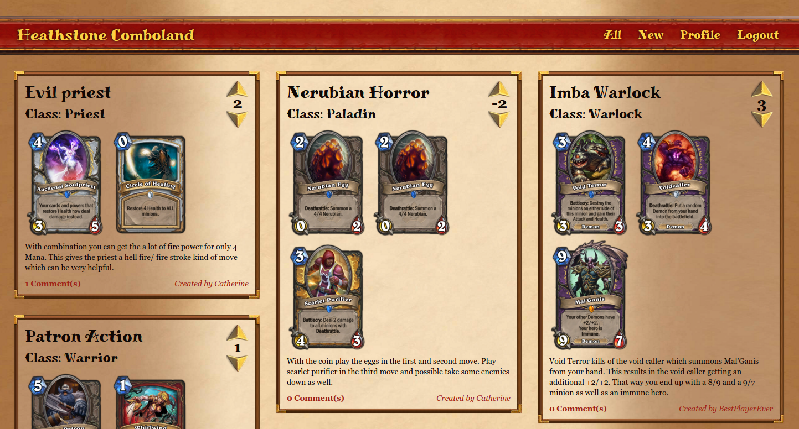

# hearthstone-comboland
Share and discuss your favourite combination of cards in Blizzards Hearthstone.

# Hearthstone Comboland
<i>1-2 weeks project - started September 14, 2015</i>

https://comboland.herokuapp.com



## Description
Comboland is centered around the card combinations in Blizzard's polular digital card game "Hearthstone - Hereos of Warcraft". After logging in you can explore the combos of other users and add a new combination on your own. To do that, simply visit the new page, enter a combo name and select the respective hero class. After that you can start building your combination with a comfortable typeahead search field. Later on, visit your profile page for easy access to all the combinations you entered. You can also vote or comment on combinations of others that you like or dislike.

## Inspiration
I was quite addicted to Hearthstone when I started playing it some time ago. It's a masterpiece of Blizzard's perfectionism and the "easy to learn, hard to master" concept. I found a <a href="https://www.mashape.com/omgvamp/hearthstone" target="_blanck">Mashape API</a> that provided me with the data I needed to build an app around the game so I built Comboland.

## Front-end
### JavaScript code
The front-end is build with <a href="https://angularjs.org/" target="_blanck">AngularJS</a> and the code is structured the following way.

* __app.js__: Here, additional modules like <a href="https://github.com/passy/angular-masonry" target="_blanck">Angular Masonry</a> and <a href="https://angular-ui.github.io/bootstrap/" target="_blanck">Angular UI Bootstrap</a> are injected into the angular app. Also the interceptor used for authentication (see services) is added to the app configuration. Last, the file contains the front-end router with all the routes for the app. It is implemented with the original <a href="https://docs.angularjs.org/api/ngRoute" target="_blanck">ngRoute</a>.
* __resources__: `Combo` and `User` are set up as <a href="https://docs.angularjs.org/api/ngResource/service/$resource" target="_blanck">angular resources</a> to interface with the RESTful backend API. Some additional methods like "login" and "get heros" had to be added manually but all the rest is already ready to use with very little code. There is also a `Card` resource but since there is only one action needed here it is implemented with the plain angular http instead of ngResource.
* __controllers__: The UserController is set up in the body of single page served by the backend. That way the function `user.isLoggedIn()` is available in all templates to allow appearance of html elements depending on authentication status of the user. The controllers for the RESTful actions are specific for the respective page as recommended in the Angular documentation (`indexController`, `newController`, `showController`, etc.).
* __services__: The services realize the authentication in this Angular app. The TokenService performs all actions related to storing and retrieving the token and the contained information (user ID). Another service called `authInterceptor` (see code below) stores the token in the session storage via the TokenService if the respone contains a token. It also attaches the token to every outgoing request as Authorization header.

```javascript
function AuthInterceptor(TokenService) {
  return {    
    request: function(config) {
      var token = TokenService.getToken();
      if (token) config.headers.Authorization = 'Bearer ' + token;
      return config;
    },
    response: function(res) {
      if(res.data.token) TokenService.saveToken(res.data.token);
      return res;
    }
  }
}
```

### Markup
The markup consists of an index.html page served by the backend which serves as general layout. It links the CSS and JavaScript files and includes the navigation. All other pages are then inserted via `ng-view` from the respective template.<br>
When adding a new combination the user has two choices to select the cards to add. Either from a simple drop-down list or with a typeahead search field (see markup below). Based on any array/ object in the controller the nice typeahead feature from <a href="https://angular-ui.github.io/bootstrap/" target="_blanck">Angular UI Bootstrap</a> allows to implement such a search. The dropdown list that appears depending on the searched letters can be styled with a custom template. That allows for example to include a small preview picture and not just the name of the card.

```html
<div class="form-group typeahead-container">
  <label>Search by name</label>
  <input type="text" ng-model="searchedCard" typeahead="card as card.name for card in combos.cards | filter:{name:$viewValue} | limitTo:8" typeahead-template-url="templates/customTypeahead.html" typeahead-on-select="combos.currentCard=searchedCard; selectedCardIndex='';" class="form-control bottom-margin input-lg">
</div>
```

### Styling
The SASS version of <a href="#" target="_blanck">Bootstrap</a> is used as CSS framework for this app. The bootstrap grid system is used to provide responsive column layouts and navigation throughout the app. Variable overrides are defined in `custom_bootstrap_variables.scss`. In `style.scss` they are then imported before the Bootstrap files from the bower folder. Afterwards the custom style files for general settings, utilities, buttons, etc. are imported to ensure the proper overriding sequence. A Grunt task is used to watch the SCSS folder for changes and recompile the files into css.

## Back-end
### Framework
A NodeJS app provides a stand-alone back-end API for this project. To avoid serving the single page needed for the front-end via seperate server this is also done by the backend.<br>
Routes and controller functions (mainly RESTful actions) are seperated into different files. The user controller leverages a local strategy from <a href="http://passportjs.org" target="_blanck">PassportJS</a>. The password is encrypted using BCrypt before saving it to the database. When a login request comes in the user controller checks the password using the respective BCrypt method attached to the user model. Then a JSON Web Token (with a certain expiry date) is sent back to the user which grants him access to protected API actions like changing combos etc. Accordingly incoming request are checked for the JWT. The unless function allows to set exceptions to the protection, e.g. to allow unauthenticated users to see the combos.
```javascript
app.use('/api', expressJWT({secret: secret})
  .unless({
     path: ['/api/users/login', '/api/users/signup', /\/api\/combos\/?$/]
  })
);
```

Unfortunately the data provided by the <a href="https://www.mashape.com/omgvamp/hearthstone" target="_blanck">Mashape API</a> was not very well organizied. To get a proper array of all cards I had to pull the data, fix it and save it into my database. Keeping the data updated is ensured with the node-scheduler task that repeats the pull of the raw data from the API every week.

### Database
This app is build on <a href="https://www.mongodb.org" target="_blanck">MongoDB</a>. For the deployed version the database is provided by the Heroku add-on MongoLab. <a href="http://mongoosejs.com/" target="_blanck">Mongoose</a> is used as ODM. The schema is setup so that the cards and the comments are embedded in the combo since they do not exists on their own without a combo. The user on the other hand exists independent of the combo and is only referenced via its object ID as shown in the code below.
```javascript
var comboSchema = new mongoose.Schema({
  name: String,
  description: String,
  rating: Number,
  hero : mongoose.Schema.Types.Mixed,
  cards: [Card.schema],
  comments: [Comment.schema],
  user: {type: mongoose.Schema.Types.ObjectId, ref: 'User'}
});
```

Using appropriate MongoDB commands many actions on the combo can be performed via a generic update combo function in the backend. For example, comments can be added via `$push` or the rating can be changed by either sending 1 or -1 as an increment to the current rating via `$inc`.

```
// Adding a comment
Combo.update({id: combo._id}, {$push: {comments: comment}}, function(){
  self.current.comments.push(comment);
  self.newCommentText = "";
});

// Changing the rating
Combo.update({id: combo._id}, {$inc:{rating: number}},function(){
  self.current.rating += number;
});
```
